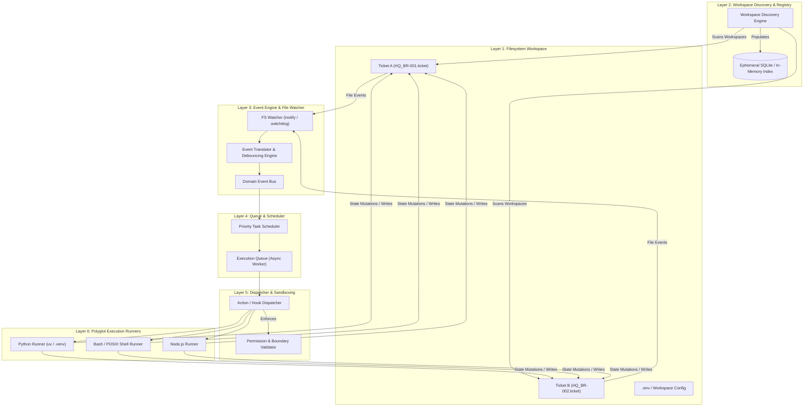
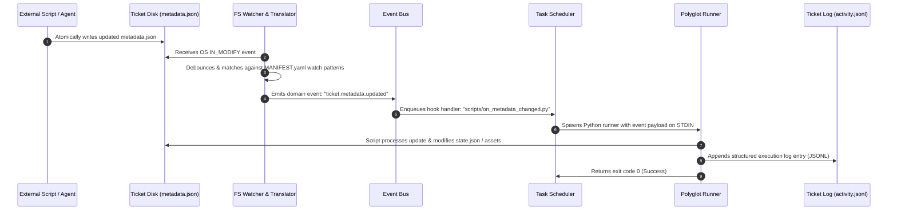

# FRAME Master Architecture Specification
## Chapter 1: Architecture Overview & System Topology

---

## 1. System Layer Overview

The **FRAME Engine** (`framed`) is structured into six decoupled, single-responsibility layers. This separation ensures that filesystem monitoring, event translation, task queuing, and script execution operate cleanly without monolithic locks or tight coupling.

---

## 2. Component Specifications

### 2.1 Workspace Layer (Data & Contract Sovereignty)
The Workspace Layer consists of physical directories on disk containing `.ticket` bundles. 
- **No Shared Process Memory**: Tickets interact strictly through filesystem changes, domain events, or declared Action APIs.
- **Local Scope**: Each Ticket manages its own local files, scripts (`scripts/`), working directories (`task/assets/`), and local configuration (`.env`).

### 2.2 Workspace Discovery & Registry Layer
The **Discovery Engine** scans designated workspace roots recursively to identify valid Ticket bundles.
- **Trigger**: Runs at runtime startup and periodically or upon new directory creation events (`IN_CREATE`).
- **Validation**: Checks for the presence of `MANIFEST.yaml`. If present, parses identity metadata and validates syntax against the `ticket/v1` schema.
- **Ephemeral Index**: Populates an internal SQLite/in-memory cache indexed by `ticket_id`, file path, `kind`, tags, and active relationships.

> [!IMPORTANT]
> **Ephemeral Projection Principle**: If the SQLite index file is deleted or corrupted, the runtime rebuilds it from scratch by re-scanning disk manifests. The index MUST NEVER contain authority-level state that does not exist on disk.

### 2.3 Event Engine & File Watcher Layer
Translates noisy low-level OS file events into high-level, debounced domain events.
- **OS Primatives**: Uses `inotify` (Linux) or native OS APIs via `watchdog` / `watchfiles`.
- **Low-Level Events**: `IN_MODIFY`, `IN_CREATE`, `IN_DELETE`, `IN_MOVED_TO`.
- **Event Translation**: Maps specific file modifications to domain events:
  - Edit to `metadata.json` $\rightarrow$ `ticket.metadata.updated`
  - Modification of `state.json` $\rightarrow$ `ticket.state.changed`
  - Addition of file to `task/assets/` $\rightarrow$ `ticket.asset.created`
- **Debouncing & Coalescing**: Groups rapid succession file edits (e.g., text editor saves or multi-file writes) within a configurable window (default: $300\text{ms}$) into a single domain event.

### 2.4 Queue & Scheduler Layer
Manages execution order, concurrency limits, and retry policies for triggered hooks and actions.
- **Priority Queue**: Higher-priority tasks (e.g. emergency failure handlers or explicit human commands) take precedence over background sync scripts.
- **Concurrency Control**: Enforces worker pool thread/process limits to prevent CPU exhaustion during cascading events.
- **Cycle Detection**: Tracks event correlation chains (`trace_id`, `parent_event_id`). If an event depth exceeds the maximum execution depth (default: $10$), execution is halted, and an emergency event loop alert is logged to `activity.jsonl`.

### 2.5 Dispatcher & Sandboxing Layer
Prepares execution context, validates permissions, and enforces path boundaries before invoking runners.
- **Path Jail Validation**: Ensures scripts cannot modify files outside designated workspace boundaries unless explicit `permissions` are granted in `MANIFEST.yaml`.
- **Environment Resolution**: Merges environment variables in order:
  1. Global System Environment
  2. Workspace Root `.env`
  3. Ticket-level `.env`
  4. Explicit `MANIFEST.yaml` execution `env` blocks.

### 2.6 Polyglot Execution Runners
Spawns subprocesses to execute script entrypoints declared in manifests.
- **Python Runner**: Detects local virtual environments (`.venv`) or executes via `uv run` for fast, isolated Python script invocation.
- **Bash/POSIX Shell Runner**: Executes shell scripts with strict flags (`set -euo pipefail`).
- **Node.js / Custom Runners**: Pluggable architecture allowing future execution environments.

---

## 3. End-to-End Event Lifecycle Sequence

The following sequence illustrates how a change to a Ticket's metadata by an external script or AI agent flows through the FRAME Engine to trigger automated actions.

---

## 4. Architectural Rationale Matrix

| Component / Subsystem | WHAT | WHY | HOW |
| :--- | :--- | :--- | :--- |
| **Decoupled FS Watcher** | Single runtime daemon watches entire workspace rather than per-ticket processes. | Minimizes system resource usage (CPU/memory) and avoids process context-switching overhead. | Single `watchdog` thread managing recursive watches, maintaining path-to-Ticket lookup maps. |
| **Domain Event Translation** | Map raw file paths to high-level semantic events (`ticket.assigned`, `asset.created`). | Decouples business logic in scripts from low-level filesystem structure and OS platform differences. | Configured via `watch` maps in `MANIFEST.yaml` processed by the Runtime Event Translator. |
| **Atomic Disk Mutex Pattern** | Enforce write-to-temp + rename pattern (`os.replace`) for all JSON writes. | Prevents runtime or external readers from reading partial, corrupt JSON files during write operations. | Enforced by FRAME Python SDK and CLI commands; documented as standard requirement for custom scripts. |
| **Recursion Guard & Trace IDs** | Track `trace_id` and `event_depth` in event context. | Prevents infinite execution loops where script triggers an event that re-executes itself. | Increments `event_depth` on event emission; aborts and logs error if depth $> 10$. |
