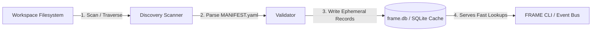

# FRAME Master Architecture Specification
## Chapter 4: Runtime Engine Internals & Concurrency Model

---

## 1. Overview

The **FRAME Runtime Engine** (`framed`) operates as an event-driven controller. It manages workspace discovery, file watching, event debouncing, task queuing, lock resolution, and process execution.

This chapter details the internal mechanics of the engine, explaining how concurrency, state isolation, and recovery are guaranteed.

---

## 2. Core Subsystems

### 2.1 Workspace Discovery & Ephemeral Index (`frame.db`)
The runtime daemon initializes by recursively scanning all configured workspace directories.
- **Scanning Algorithm**: Traverses directories looking for `*.ticket/` or folders containing `MANIFEST.yaml`.
- **Index Store**: Stores discovered tickets in a local SQLite database (`frame.db`) residing in the user's cache directory (e.g. `~/.cache/frame/frame.db`).
- **Index Data**:
  - `ticket_id` (Primary Key)
  - `path` (Absolute filesystem path)
  - `kind`
  - `status`
  - `manifest_hash` (SHA-256 hash of `MANIFEST.yaml` for change detection)
  - `mtime` (Last modified timestamp of key files)



---

### 2.2 Event Engine & File Watcher (`WatcherDaemon`)
- **Event Filtering**: The watcher ignores temporary editor files (`*.swp`, `*~`, `.tmp.*`) and FRAME internal logs (`activity.jsonl`) to prevent loop triggers.
- **Sliding Window Debouncing**: When file modification events occur, they enter a sliding window buffer.
  - If multiple edits happen to `metadata.json` within $300\text{ms}$, only ONE `ticket.metadata.updated` domain event is emitted containing the final state.

---

### 2.3 Task Queue & Execution Worker Pool
- **Async Queue**: Uses a thread-safe priority queue (`asyncio.PriorityQueue` / worker pool).
- **Task Prioritization**:
  1. `Priority 0` (Emergency / Cancellation Handlers)
  2. `Priority 1` (Direct CLI / User Action Commands)
  3. `Priority 2` (File Modification Hooks)
  4. `Priority 3` (Background Asset Indexing / Maintenance)

---

## 3. Concurrency & Locking Model

Because FRAME allows multiple scripts, CLI callers, and AI subagents to modify Ticket state simultaneously, it enforces a two-tier locking strategy:

### 3.1 Tier 1: Process-Level Advisory File Locks (`flock`)
When writing to `state.json`, `metadata.json`, or appending to `activity.jsonl`, processes MUST acquire POSIX advisory file locks on dedicated `.lock` files inside the Ticket root:
- `state.json.lock`
- `activity.jsonl.lock`

```
Process A                        Process B
    │                                │
    ├── Acquire state.json.lock ─────┤ (Blocked waiting for lock)
    ├── Atomic Write state.json      │
    ├── Release state.json.lock ─────► Acquires lock
    │                                ├── Atomic Write state.json
                                     └── Release lock
```

### 3.2 Tier 2: Ticket Execution Mutex (State-Based)
When a Ticket transitions to `status: running`, the runtime sets an execution mutex in `state.json`. If another action request arrives for the same Ticket while `running`:
- If action is `async: true`, it is queued.
- If action is `async: false` and non-reentrant, it receives a `409 Conflict / Ticket Locked` error.

---

## 4. Crash Recovery & Resilience

### 4.1 Cold-Boot Reconstruction
If `framed` crashes mid-execution:
1. Upon restart, `framed` purges stale in-memory queues and re-scans `frame.db`.
2. Any Ticket left with `status: running` whose process PID is no longer active is transitioned to `status: failed` or `status: ready` based on its manifest retry policy.
3. An audit log entry is written to `activity.jsonl`:
   ```json
   {"event":"runtime.crash_recovery","recovered_status":"failed","reason":"orphaned_process_detected"}
   ```

---

## 5. Rationale Matrix

| Component | WHAT | WHY | HOW |
| :--- | :--- | :--- | :--- |
| **Separate `.lock` Files** | Use dedicated `.lock` files rather than locking target JSON files directly. | Atomic file replacement (`os.replace`) changes the file inode, which breaks locks held on target files. Lock files maintain constant inodes. | Open `.lock` file, invoke `fcntl.flock(fd, LOCK_EX)`, perform atomic swap on JSON file, release lock. |
| **Priority Execution Queue** | Prioritize explicit user actions over filesystem hooks. | Maintains high responsiveness for interactive CLI and agent commands while background work queues. | Tasks in `asyncio.PriorityQueue` are sorted by `(priority_level, timestamp)`. |
| **Manifest SHA-256 Hashing** | Hash `MANIFEST.yaml` content during scan. | Avoids unneeded re-parsing of unchanged manifests during periodic discovery scans. | Compare cached `manifest_hash` with current disk hash; parse YAML only on mismatch. |
