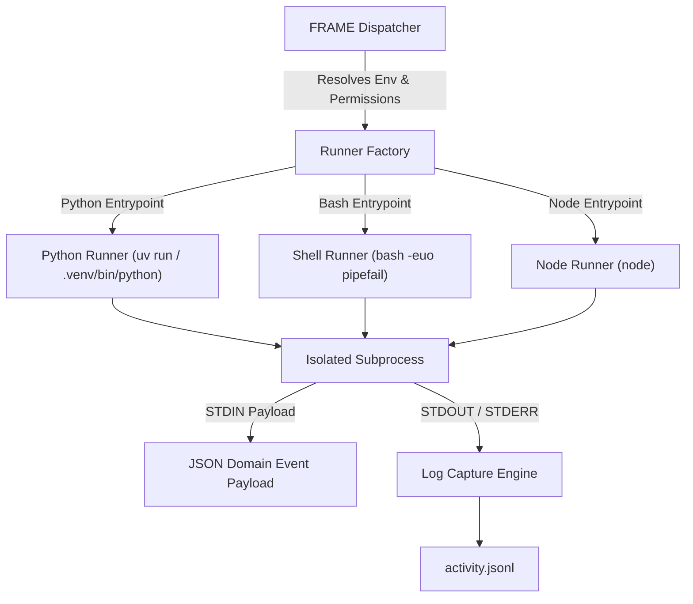

# FRAME Master Architecture Specification
## Chapter 5: Execution & Sandboxing Model

---

## 1. Overview

The **FRAME Execution Engine** manages how hooks and actions are executed. To maintain portable, lightweight performance without forcing container dependencies (like Docker), FRAME uses **direct subprocess execution with POSIX limits, `uv`/python environment resolution, and strict environment variable masking**.

---

## 2. Polyglot Runner Architecture

FRAME supports polyglot script handlers declared in `MANIFEST.yaml`.



---

## 3. Subprocess Isolation & Security Constraints

### 3.1 Path Jail Enforcement
Scripts executing within a Ticket MUST NOT attempt to write outside designated workspace boundaries unless explicit permission is declared.
- **Root Directory**: The script's default working directory (`CWD`) is set to the Ticket root (`HQ_BR-xxx.ticket/`).
- **Path Verification**: The FRAME SDK and runner sanitize all path arguments to prevent directory traversal (`../..`).

### 3.2 Environment Masking & Variable Merging
Environment variables are injected in a controlled cascading order:
1. System base environment (filtered to remove sensitive host keys unless explicitly whitelisted).
2. Workspace root `.env`.
3. Ticket local `.env`.
4. Execution payload variables (`FRAME_EVENT`, `FRAME_TRACE_ID`, `FRAME_TICKET_ID`, `FRAME_TICKET_PATH`).

```python
# Environment variable sanitizer pseudo-code
DENYLIST = {"AWS_SECRET_ACCESS_KEY", "DATABASE_URL", "SSH_AUTH_SOCK", "SUDO_USER"}

def build_execution_env(ticket_env: dict, manifest_env: dict, payload_env: dict) -> dict:
    base_env = {k: v for k, v in os.environ.items() if k not in DENYLIST}
    merged = {**base_env, **ticket_env, **manifest_env, **payload_env}
    return merged
```

### 3.3 Execution Limits (Timeouts & Process Groups)
- **Timeouts**: Every action and hook has a `timeout` specifier (default: $30\text{s}$). Upon timeout expiry, the runtime sends `SIGTERM` to the process group, followed by `SIGKILL` after $3\text{s}$ if the process fails to terminate.
- **Process Groups**: Scripts are launched in isolated process groups (`os.setsid`) so that any background children spawned by the script are killed when the handler finishes or times out.

---

## 4. Python Environment Resolution (`uv` Integration)

For Python script handlers, FRAME leverages **`uv`** for lightning-fast, reproducible virtual environment resolution:

1. **Local Venv Detection**: If `.ticket/.venv` or workspace `.venv` exists, the runner uses `.venv/bin/python`.
2. **`uv` Execution**: If `uv` is installed, the runner executes:
   ```bash
   uv run --with-requirements requirements.txt scripts/handler.py
   ```
3. **STDIN / STDOUT Protocol**: Event payloads are passed to the script via STDIN as a single-line JSON string:
   ```json
   {"event":"ticket.metadata.updated","ticket_id":"HQ_BR-001","timestamp":"2026-08-07T19:20:00Z","data":{}}
   ```

---

## 5. Rationale Matrix

| Decision | WHAT | WHY | HOW |
| :--- | :--- | :--- | :--- |
| **POSIX Subprocess Isolation** | Use `os.setsid` and environment masking over heavy containers. | Keeps FRAME footprint tiny, lightning-fast ($<5\text{ms}$ startup), and zero-dependency across Linux/macOS. | Spawns subprocesses in dedicated process groups with strict resource limits. |
| **STDIN Payload Ingestion** | Pass event context via STDIN JSON. | Language-agnostic interface; handlers in Python, Bash, Node, or Go can read STDIN easily. | Runner writes JSON string to process STDIN before closing input stream. |
| **Process Group Termination** | Kill process group (`pgid`) on timeout. | Prevents orphaned background processes or lingering sub-threads from leaking memory or CPU. | Invokes `os.killpg(os.getpgid(proc.pid), signal.SIGKILL)`. |
