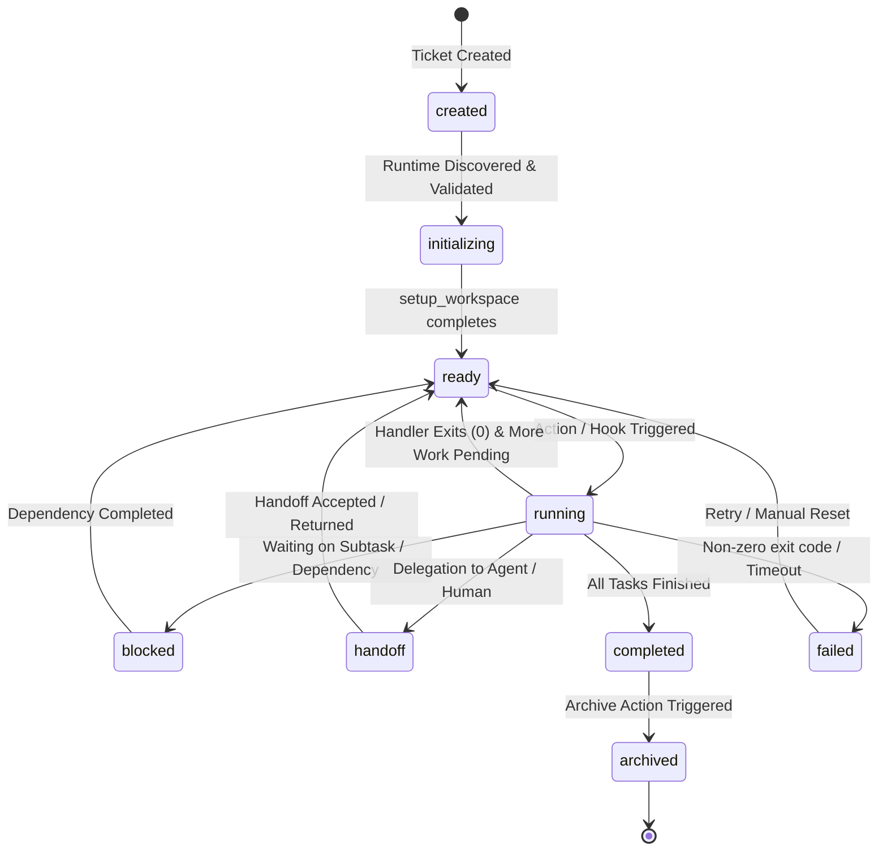

# FRAME Master Architecture Specification
## Chapter 6: Lifecycle & State Machine Specification

---

## 1. Overview

Every Ticket in FRAME follows a formal **State Machine**. State transitions are recorded in `state.json` and audited in `activity.jsonl`.

---

## 2. State Machine Topology

---

## 3. State Definitions & Invariants

| State | Description | Allowed Next States |
| :--- | :--- | :--- |
| `created` | Ticket bundle exists on disk; `MANIFEST.yaml` present. | `initializing` |
| `initializing` | Workspace setup scripts (`setup_workspace.py`) currently running. | `ready`, `failed` |
| `ready` | Ticket is fully configured, validated, and awaiting triggers. | `running`, `archived` |
| `running` | An action or hook handler is actively executing. | `ready`, `blocked`, `handoff`, `completed`, `failed` |
| `blocked` | Execution paused waiting on child ticket or external dependency. | `ready`, `failed` |
| `handoff` | Control temporarily yielded to human engineer or AI agent. | `ready`, `running`, `failed` |
| `completed` | Ticket work items finished successfully; outputs generated in `task/assets/`. | `archived` |
| `failed` | Process exited with error code or timed out. Needs retry or reset. | `ready`, `initializing`, `archived` |
| `archived` | Read-only state. In-memory watch handles unmounted. | *(Terminal)* |

---

## 4. Parent-Child & Graph State Propagation

When Tickets form hierarchical or dependency graphs (e.g. Parent Ticket delegating work to 3 Child Sub-tickets):

1. **Child Blocking Parent**:
   - Parent Ticket transitions to `status: blocked` with `relationships.dependencies = ["child-001", "child-002"]`.
2. **Child Completion Event**:
   - When `child-001` transitions to `completed`, it emits `ticket.completed`.
   - The runtime updates Parent's `state.json` under `relationships.children`.
3. **Parent Unblocking**:
   - Once ALL child dependencies reach `completed`, the runtime emits `dependency.resolved`, transitioning Parent back to `status: ready`.

---

## 5. Rationale Matrix

| Transition Rules | WHAT | WHY | HOW |
| :--- | :--- | :--- | :--- |
| **Explicit `handoff` State** | Add `handoff` state distinct from `running`. | Allows AI subagents or humans to own a Ticket without holding runtime process locks open indefinitely. | State metadata stores `assignee.id` and `assignee.type` ("agent" vs "human"). |
| **Automatic Graph Unblocking** | Runtime updates parent state upon child completion. | Decouples sub-tickets from having to manually find and edit parent files. | Runtime evaluates graph dependencies in `frame.db` whenever any ticket emits `ticket.completed`. |
