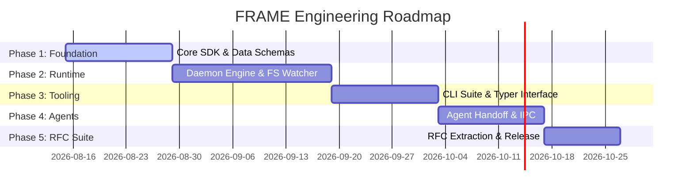

# FRAME Master Architecture Specification
## Chapter 8: Implementation Roadmap & Verification Strategy

---

## 1. Phased Engineering Roadmap

---

## 2. Milestone Deliverables

### Phase 1: Core Specifications & Python SDK (`frame-sdk`)
- Implement JSON Schemas for `metadata.json`, `state.json`, `activity.jsonl`, and `MANIFEST.yaml`.
- Build `frame_sdk` with atomic file write context managers (`os.replace`) and advisory file locking (`fcntl.flock`).
- **Deliverable**: `pip install frame-sdk` package with 100% unit test coverage.

### Phase 2: Runtime Daemon & Event Engine (`framed`)
- Build recursive workspace scanner and SQLite ephemeral cache (`frame.db`).
- Implement `inotify`/`watchdog` file watcher with sliding-window debouncing ($300\text{ms}$).
- Implement Priority Execution Queue and polyglot runners (Python via `uv`, Bash).
- **Deliverable**: `framed` background daemon CLI.

### Phase 3: CLI Tooling Suite (`frame`)
- Implement Typer CLI (`frame init`, `frame watch`, `frame list`, `frame run`, `frame inspect`).
- Integrate rich visual output formatting and `--json` programmatic output flags.
- **Deliverable**: `frame` CLI binary/pip tool.

### Phase 4: Agent Handoff & Multi-Ticket Orchestration
- Build parent-child dependency graph auto-unblocking logic.
- Implement agent handoff protocols and subagent context injection.
- **Deliverable**: End-to-end integration demo with Antigravity / subagent workflow.

### Phase 5: RFC Suite Derivation
- Derive standalone versioned RFC documents (`RFC-0000` to `RFC-0008`) from the Master Specification for public open-source publication.

---

## 3. Verification & Quality Assurance Strategy

1. **Atomic Write Torture Test**: Multi-threaded process harness attempting 10,000 parallel writes to `state.json` to verify zero corruption.
2. **FS Watcher Stress Test**: Emulate rapid file creation (1,000 files/sec) to verify debouncing and queue bounds.
3. **Crash Recovery Validation**: Force-kill (`SIGKILL`) the runtime daemon mid-execution and verify 100% cold-boot index reconstruction from disk.
