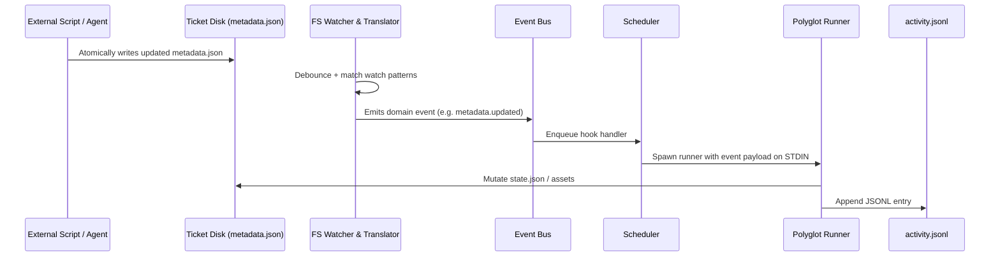

# Part II — Architecture

## 1. Purpose
Describe the overall structure of Tessera: the major components, how they connect, and the data/control
flow from a filesystem change to executed automation. This Part is the map; later Parts are the
detailed surveys of each region.

## 2. Motivation
Without a single architectural picture, the runtime components (watcher, registry, event bus,
scheduler, dispatcher, executor) drift into overlapping responsibilities and become unmaintainable.
Kubernetes, Terraform, Git, and systemd all succeed partly because their controller/control-plane
separation is explicit. Tessera adopts the same discipline.

## 3. Responsibilities
The architecture as a whole is responsible for:
- Discovering Tickets in the `TicketRepository/`.
- Maintaining a derived registry index.
- Watching the filesystem for changes (and accepting externally-emitted events).
- Translating filesystem changes into domain events.
- Scheduling, dispatching, and executing declared hooks/actions.
- Tracking state, recording history, and enforcing locks/permissions.
- Exposing a CLI and SDK without owning Ticket data.

## 4. Design

### 4.1 The execution pipeline
```
Filesystem / External Event
        │
        ▼
   Discovery  ──────────────►  Registry (SQLite, derived)
        │
        ▼
     Watcher  (inotify over TicketRepository)
        │  filesystem events
        ▼
   Event Bus  (domain events: metadata.updated, ticket.assigned, …)
        │
        ▼
   Scheduler  (queues, workers, priorities, retries, locks, deps)
        │
        ▼
  Dispatcher  (select runner/executor for a hook/action)
        │
        ▼
   Executor   (python / bash / node / … runners)
        │
        ▼
     Ticket   (state.json, activity.jsonl, task/ mutated under lock)
```

### 4.2 Separation of concerns
- **Discovery vs Watcher.** Discovery runs at startup (and on demand) to build the registry. The
  Watcher reacts to ongoing changes. Discovery is allowed even when the registry is empty/corrupt.
- **Watcher vs Event Bus.** The Watcher produces *filesystem* events; the Event Bus carries
  *domain* events. The runtime translates the former into the latter so hooks never depend on the
  detection mechanism (inotify, polling, API).
- **Event Bus vs Scheduler.** The bus is a notification fan-out. The Scheduler is the policy owner
  (ordering, concurrency, retries). This prevents scheduling logic from leaking into the bus or the
  dispatcher.
- **Dispatcher vs Executor.** Dispatcher *chooses* how to run; Executor *runs*. Adding a language is
  adding an Executor/runner, not touching dispatch logic.

### 4.3 Singleton runtime per repository
A `runtime.sock` (preferred) or `runtime.pid` inside `.ticket-runtime/` enforces that exactly one
runtime owns a repository (Invariant I-6). A second `ticket watch` connects to the existing socket
rather than spawning a competing watcher.

### 4.4 Derived registry
`registry.db` maps ticket `id` → path, parent id, state, manifest version, last-scanned. It is
rebuilt by rescanning (Invariant I-9). It is never the source of truth.

### 4.5 Workspace vs Repository (terminology boundary)
- **TicketRepository** = where Tickets live (`FrameworkRoot/Tickets/`). Canonical, editable.
- **Workspace** = an *external* directory where actual work happens, referenced by a Ticket's
  `.env`/`metadata.json`. The runtime does not discover Tickets there; it may operate there under a
  Ticket's granted permissions.

## 5. Directory Layout
See the Master index for the full authoritative layout. Key architectural directories:
- `FrameworkRoot/Tickets/` — repository (source of truth).
- `FrameworkRoot/Tickets/.ticket-runtime/` — disposable runtime state.
- `FrameworkRoot/lib/ticket-management/` — the runtime implementation.
- `FrameworkRoot/Skills/` — separate resource repository (future runtime).

## 6. Lifecycle
The runtime process itself has a lifecycle:
1. **Boot** — load `config.yaml`, verify singleton (socket/pid), open/repair registry.
2. **Discover** — scan repository, build registry, validate manifests.
3. **Watch** — register inotify watches over the repository.
4. **Run** — process events through bus → scheduler → dispatcher → executor; serve CLI/SDK over socket.
5. **Shutdown** — drain queues (graceful), release locks, remove socket/pid.

## 7. Interaction
- **With Tickets:** read-only discovery + locked, permission-scoped state mutation.
- **With other runtimes:** v1 has none (single per repository). Future: cross-repository event
  bridging (deferred).
- **With users/agents:** via CLI and SDK (Parts X, XI), which translate requests into actions/events.

## 8. Failure Modes
| Failure | Handling |
| --- | --- |
| Corrupt `registry.db` | Discard and rescan (derived). |
| Two runtimes start | Second connects to existing socket; does not watch. |
| Malformed manifest | Ticket flagged invalid; recorded; not registered for execution. |
| Watcher miss (e.g. rapid edits) | Scheduler debounces; periodic rescan reconciles. |
| Runtime crash | `.ticket-runtime/` disposable; restart rebuilds registry; locks stale → reaped on boot. |

## 9. Security
The architecture keeps all privileged/stateful operations inside the runtime, behind the Scheduler and
Permission system (Part IX). Tickets remain plain files; security is enforced at execution time, not
by obscuring the filesystem.

## 10. Future Extensions
- **Distributed Scheduler:** workers on multiple nodes; registry becomes shared. (Deferred in v1.)
- **Multi-repository bus:** events bridge between TicketRepository and future Skill/Workflow repos.
- **Alternative watchers:** macOS/FSEvents, Windows, or polling backends behind the same Watcher API.

## 11. Examples
A change to `HQ_BR-001.ticket/metadata.json`:
1. inotify reports `IN_MODIFY` on that path.
2. Watcher maps path → ticket `HQ_BR-001`, emits domain event `metadata.updated`.
3. Event Bus fans out to subscribers.
4. Scheduler enqueues the Ticket's `metadata.updated` hooks (sequential per workspace queue).
5. Dispatcher picks the `python` runner for `scripts/update_summary.py`.
6. Executor runs it with the resolved environment; on success, state/activity may be updated under lock.

## 12. Rationale
The pipeline is deliberately linear and single-responsibility so each stage can be replaced or
reimplemented (e.g. a Rust runtime) without disturbing the Ticket format or the manifest contract.
The explicit Scheduler stage exists because omitting it caused scheduling logic to accumulate in the
Dispatcher during design review — a known anti-pattern the user agreed to avoid.

---

> **REVISION — Appended from FRAME documentation (Rev A · 2026-08-07).**
> *Non-destructive: all prior text in this document is unchanged and remains canonical. This block augments it with material drawn from the FRAME spec set (same design, independent authorship). Status: Appended.*

### R.A.2 — Layer-topology correspondence & end-to-end sequence

FRAME decomposes the same engine into six single-responsibility layers. The mapping to Tessera's pipeline (Part II §4.1) is direct:

| FRAME layer | Tessera stage |
| --- | --- |
| 1. Filesystem Workspace | TicketRepository (source of truth) |
| 2. Discovery & Registry | Discovery → Registry |
| 3. Event Engine & File Watcher | Watcher → Event Bus |
| 4. Queue & Scheduler | Scheduler |
| 5. Dispatcher & Sandboxing | Dispatcher (+ Permission check) |
| 6. Polyglot Execution Runners | Executor / Runners |

FRAME also documents the end-to-end flow as a sequence (external write → IN_MODIFY → translate → bus → scheduler → runner → state/log), consistent with Part II §11. Illustrative mermaid:


