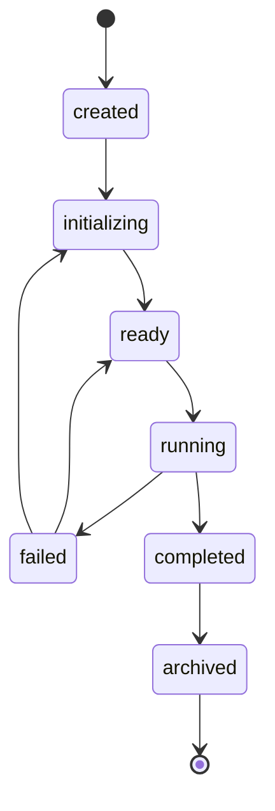

# Part VI — Lifecycle & State Machine

## 1. Purpose
Define the fixed set of lifecycle states a Ticket moves through and the constrained transition rules.
The user specified states are fixed but transitions are flexible (a Ticket may be re-blocked after
delegation, or temporarily archived then re-initialized). This Part makes that precise and
machine-checkable.

## 2. Motivation
Without a defined lifecycle, automation becomes order-dependent and unpredictable. A fixed state set
with explicit (though flexible) transitions gives hooks a stable contract: "I run when state is X,"
and lets the Scheduler reason about what may happen next.

## 3. Responsibilities
- Enumerate the eight canonical states.
- Define legal transitions (a partial order, not a strict linear pipeline).
- Specify which lifecycle events the runtime emits on each transition.
- Specify where the current state is stored (`state.json`) and recorded (`activity.jsonl`).

## 4. Design

### 4.1 The eight states
1. **Created** — Ticket directory + manifest exist; discovered and registered. First state, always.
2. **Initialized** — `initialize` steps have run (or been deemed unnecessary). Must be followed by Ready.
3. **Ready** — Prepared to run. May follow Blocked, Archived, or Delegated.
4. **Running** — Active work in progress. Must follow Ready or Blocked.
5. **Blocked** — Cannot progress. May occur at any stage except Completed and Archived.
6. **Delegated** — Handed to an agent/sub-process. Must follow Ready or Initialized.
7. **Completed** — Work finished. Final productive state; may only move to Archived.
8. **Archived** — Retired. May renew the lifecycle, but only by returning to Initialized (re-init).

### 4.2 Transition rules (constrained flexibility)
The user's locked rules, formalized:

| From | To | Allowed? | Note |
| --- | --- | --- | --- |
| (none) | Created | ✅ | entry |
| Created | Initialized | ✅ | required next |
| Initialized | Ready | ✅ | required next |
| Ready | Running | ✅ | |
| Ready | Delegated | ✅ | |
| Ready | Blocked | ✅ | |
| Blocked | Ready | ✅ | unblock |
| Blocked | Running | ✅ | |
| Running | Blocked | ✅ | external factor |
| Running | Delegated | ✅ | |
| Running | Completed | ✅ | |
| Delegated | Blocked | ✅ | re-blocked after delegation |
| Delegated | Ready | ✅ | returned |
| Delegated | Completed | ✅ | |
| Completed | Archived | ✅ | only allowed exit |
| Archived | Initialized | ✅ | renew (re-init required) |
| Completed | Ready | ❌ | must archive first |
| Archived | Running | ❌ | must re-init first |
| Blocked | Completed | ❌ | not from Blocked directly |
| (any) | Created | ❌ | Created is entry-only |

These rules are enforced by the runtime; an illegal transition attempt is rejected and logged.

### 4.3 Lifecycle events emitted
The runtime emits domain events on transitions (consumed by hooks via the Event Bus):
- `ticket.created`
- `ticket.initialized`
- `ticket.ready`
- `ticket.running`
- `ticket.blocked`
- `ticket.delegated`
- `ticket.completed`
- `ticket.archived`
- `ticket.reinitialized` (Archived → Initialized)

Hooks subscribe to these like any other domain event (e.g. `completed: [scripts/archive.py]`).

## 5. Directory Layout
Current state is persisted in `state.json`:
```json
{ "lifecycle": "Running", "assignee": "alice", "locks": [], "last_transition": "2026-08-07T10:00:00Z" }
```
Every transition appends a line to `activity.jsonl`:
```json
{"ts":"2026-08-07T10:00:00Z","event":"ticket.running","from":"Ready","to":"Running"}
```

## 6. Lifecycle (of the lifecycle)
N/A — this Part *is* the lifecycle definition.

## 7. Interaction
- **Scheduler** consults state to decide whether a hook/action may run (e.g. don't run `Running`-only
  action while `Blocked`).
- **Event Bus** carries lifecycle events to hooks.
- **State Manager** (`runtime/state.py`) owns transitions and persistence.
- **Manifest** may declare hooks on lifecycle events.

## 8. Failure Modes
| Failure | Handling |
| --- | --- |
| Illegal transition requested | Reject; log; emit `ticket.transition.rejected`. |
| `state.json` missing/corrupt | Assume `Created`; re-run discovery/initialize on next pass. |
| Concurrent transition | Serialized by ticket-level lock (Part VIII + IX). |

## 9. Security
State transitions are runtime-internal operations protected by the ticket lock. A hook cannot force a
transition except by emitting an event the runtime treats as a transition trigger (explicit,
logged). Direct state mutation outside the State Manager is not a valid transition.

## 10. Future Extensions
- **Custom states per resource type:** a future `kind` (e.g. `Workflow`) may declare additional
  states under a new `apiVersion`. The core eight remain the Ticket contract.
- **Time-based transitions:** Scheduler could auto-block a `Running` ticket after a timeout.

## 11. Examples
A Ticket is created, initialized, becomes ready, is delegated, gets blocked by an external factor,
unblocks, completes, is archived, then later renewed:
```
Created → Initialized → Ready → Delegated → Blocked → Ready → Completed → Archived → Initialized …
```
Every arrow is legal per §4.2.

## 12. Rationale
Fixed states give automation a stable vocabulary; flexible transitions respect real-world messiness
(re-blocking, temporary archival). Encoding the user's exact Q10 rules as a transition table makes the
contract enforceable and testable rather than advisory. Requiring `Archived → Initialized` (never
directly to `Running`) prevents "zombie" tickets skipping setup. `Completed` having a single exit
(Archived) keeps terminality meaningful.

---

> **REVISION — Appended from FRAME documentation (Rev A · 2026-08-07).**
> *Non-destructive: all prior text in this document is unchanged and remains canonical. This block augments it with material drawn from the FRAME spec set (same design, independent authorship). Status: Appended.*

### R.A.6 — `failed` state & crash-recovery transitions (from FRAME Ch.6)

*Augmentation, not replacement:* the canonical eight-state table in §4.2 remains authoritative for v1. FRAME models failure as a first-class state; Tessera currently records failure only as an event (`ticket.action.failed`). Proposed addition:

- **`failed`** — handler exited non-zero or timed out; recoverable via retry or manual reset. Allowed next: `ready`, `initializing`, `archived`.

Appended transition rows (do not alter existing §4.2 rows):

| From | To | Allowed? | Note |
| --- | --- | --- | --- |
| Running | failed | ✅ | non-zero exit / timeout |
| failed | ready | ✅ | retry / manual reset |
| failed | initializing | ✅ | re-run setup |
| failed | archived | ✅ | give up |

Crash recovery (Part III R.A.3) drives `Running → failed/ready` on orphaned PID.


